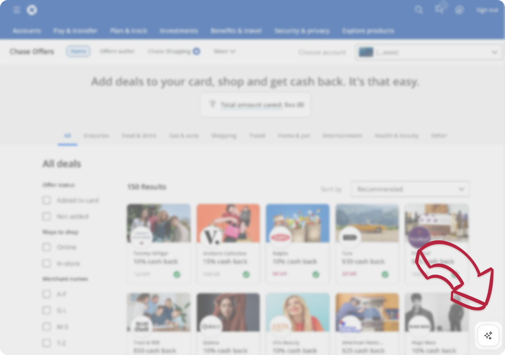

# Chase One-Click Offer Activator

### Author

- **Anh Pham**
- [Website](https://anhpham.dev)
- License: MIT

## Description

This userscript adds a floating button to Chase's offer hub page, allowing users to activate all available offers with a single click.

## Installation

Click the link below to install the script directly:

- [One-Click Install](https://github.com/phuanh004/Chase-One-Click-Offer-Activator/raw/main/Chase-One-Click-Offer-Activator.user.js)

## Features

- **One-Click Activation**: A single button to activate all offers instantly.
- **Modern Design**: Clean, floating button interface.

## Compatibility

Tested with popular userscript managers:

- **Tampermonkey**
- **Violentmonkey**

## License

This project is licensed under the MIT License - see the [LICENSE](LICENSE) file for details.
